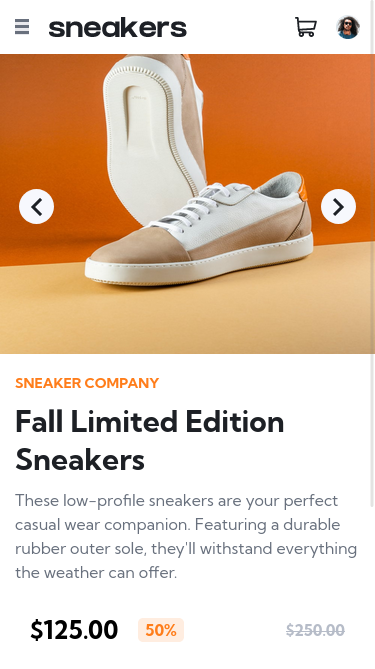
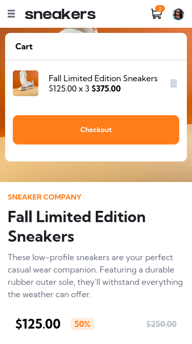
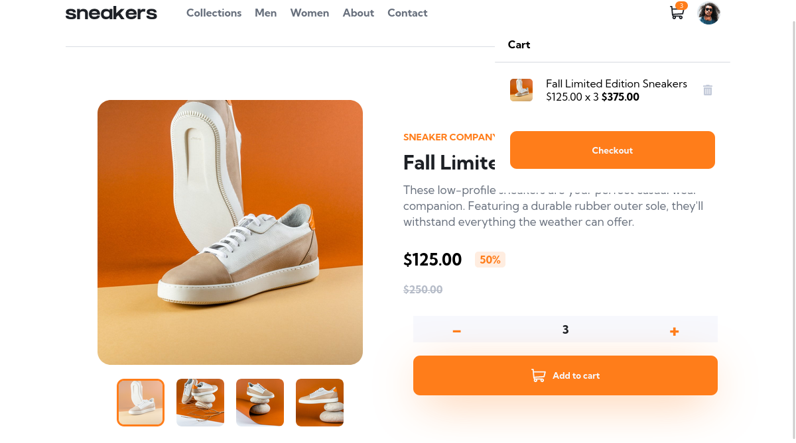

# Frontend Mentor - E-commerce product page solution

This is a solution to the [E-commerce product page challenge on Frontend Mentor](https://www.frontendmentor.io/challenges/ecommerce-product-page-UPsZ9MJp6). Frontend Mentor challenges help you improve your coding skills by building realistic projects.

## Table of contents

- [Overview](#overview)
  - [The challenge](#the-challenge)
  - [Screenshot](#screenshot)
  - [Link](#links)
- [My process](#my-process)
  - [Built with](#built-with)
- [Author](#author)
- [Acknowledgments](#acknowledgments)

## Overview

### The challenge

Users should be able to:

- View the optimal layout for the site depending on their device's screen size
- See hover states for all interactive elements on the page
- Switch the large product image by clicking on the small thumbnail images
- Add items to the cart
- View the cart and remove items from it

### Screenshot

  

    
    
  

  

    
  

### Link

- Live Demo: [https://e-commerce-chichodev.netlify.app/](https://e-commerce-chichodev.netlify.app/)

### Built with

- Semantic HTML5 markup
- CSS custom properties
- Flexbox
- CSS Grid
- Mobile-first workflow
- [React](https://reactjs.org/) - JS library
- [Typescript](https://www.typescriptlang.org/) - Strongly typed programming language that builds on JavaScript,

## Author

- Website - [My Porfolio](https://guillermo-portfolio.netlify.app/)
- Frontend Mentor - [@Guille-Sanchez](https://www.frontendmentor.io/profile/Guille-Sanchez)
- LinkedIn - [Guillermo Sanchez](https://www.linkedin.com/in/guillermo-sanchez-52a616268)